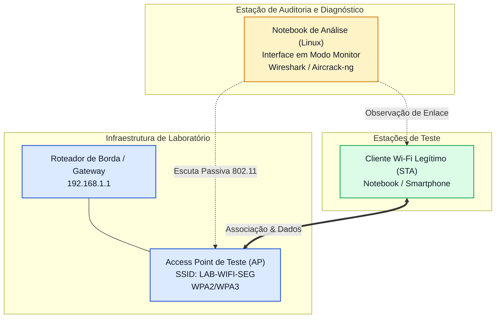

# Laboratórios de Redes Wi-Fi: Descoberta, Acesso, Hardening e Troubleshooting


**Instituição:** Universidade de Brasília (UnB)  
**Departamento:** Departamento de Engenharia Elétrica (ENE)  
**Professor responsável:** [Prof. Dr. Laerte Peotta de Melo](https://github.com/peotta)  
**Repositório Oficial:** [peotta/lab-wifi](https://github.com/peotta/lab-wifi)  
**Público-alvo:** Estudantes de Engenharia de Redes de Comunicação, Engenharia Elétrica, Cibersegurança e Ciência da Computação

---

## Visão Geral do Projeto

As redes locais sem fio (**WLANs - *Wireless Local Area Networks***), regidas pelo padrão **IEEE 802.11**, operam em meio aberto e compartilhado, onde a propagação de radiofrequência (RF) expõe quadros de gerenciamento, dados e sinalização a qualquer receptor dentro do alcance eletromagnético. Essa natureza de transmissão impõe desafios singulares de desempenho, sobreposição espectral, mitigação de interferências e, primordialmente, segurança da informação.

O projeto **Lab-Wifi** reúne uma sequência didática e prática de quatro roteiros experimentais estruturados para levar o estudante desde a observação passiva do meio sem fio até a auditoria defensiva e resolução de falhas operacionais complexas:

$$\text{Reconhecimento do Meio} \longrightarrow \text{Associação e Handshake} \longrightarrow \text{Hardening Defensivo} \longrightarrow \text{Troubleshooting e Segurança}$$

---

## Trilha Prática de Aprendizagem

```mermaid
flowchart LR
    L1["<b>Lab WiFi 1</b><br/>Reconhecimento Passivo<br/><i>Beacons, Probes, RF e Modo Monitor</i>"]
    L2["<b>Lab WiFi 2</b><br/>Acesso e Autenticação<br/><i>4-Way Handshake e EAPOL</i>"]
    L3["<b>Lab WiFi 3</b><br/>Hardening e Proteção<br/><i>WPA2/WPA3, Criptografia e AP</i>"]
    L4["<b>Lab WiFi 4</b><br/>Troubleshooting e Defesa<br/><i>Interferência, Deauth e Diagnóstico</i>"]

    L1 -->|Compreensão do meio| L2
    L2 -->|Mapeamento de vulnerabilidades| L3
    L3 -->|Operação sustentável| L4

    classDef l1 fill:#dbeafe,stroke:#1d4ed8,color:#111827,stroke-width:1.5px;
    classDef l2 fill:#fef3c7,stroke:#d97706,color:#111827,stroke-width:1.5px;
    classDef l3 fill:#dcfce7,stroke:#16a34a,color:#111827,stroke-width:1.5px;
    classDef l4 fill:#fee2e2,stroke:#dc2626,color:#111827,stroke-width:1.5px;

    class L1 l1;
    class L2 l2;
    class L3 l3;
    class L4 l4;
```



---

## Matriz Sintética dos Laboratórios

| Laboratório | Arquivo | Foco Tecnológico | Tipos de Quadros / Mecanismos | Ferramentas Principais | Entregável Chave |
| :--- | :--- | :--- | :--- | :--- | :--- |
| **Lab WiFi 1** | [lab_wifi_1.md](lab/lab_wifi_1.md) | Reconhecimento e Descoberta | Quadros de Gerenciamento (*Beacons*, *Probe Req/Resp*), RSSI e Canais | `iw`, `nmcli`, `airmon-ng`, `airodump-ng`, Wireshark | Tabela espectral e análise de ambiente sem fio |
| **Lab WiFi 2** | [lab_wifi_2.md](lab/lab_wifi_2.md) | Associação e Autenticação | *Open Auth*, Associação, *4-Way Handshake* (EAPOL-Key) | `airodump-ng`, `aireplay-ng`, Wireshark, `tshark` | Captura comentada do handshake e dissecação dos frames EAPOL |
| **Lab WiFi 3** | [lab_wifi_3.md](lab/lab_wifi_3.md) | Hardening e Defesa WLAN | WPA2-AES vs. WPA3-SAE, desativação de WPS, senhas robustas e isolamento | Painel administrativo do AP, `nmcli`, `iw`, `airodump-ng` | Checklist de hardening e matriz comparativa antes/depois |
| **Lab WiFi 4** | [lab_wifi_4.md](lab/lab_wifi_4.md) | Troubleshooting e Investigação | Diagnóstico de atenuação, saturação de canal, desconexões e *deauth* | `wavemon`, `journalctl`, `airodump-ng`, Wireshark | Relatório técnico com causa provável e contramedidas |

---

## Ementa dos Roteiros de Laboratório

### [Lab WiFi 1 - Reconhecimento do Ambiente Sem Fio](lab/lab_wifi_1.md)
* **Objetivo:** Enxergar a rede "no ar" de forma estritamente passiva.
* **Abordagem:**
  - Identificação de SSID, BSSID, frequência central, canal operacional e largura de banda (20/40/80 MHz) nas faixas de 2.4 GHz e 5 GHz;
  - Diferenciação funcional entre Pontos de Acesso (APs) e Estações Clientes (STAs);
  - Configuração da interface de rede sem fio em **Modo Monitor** (*Monitor Mode*);
  - Análise profunda de parâmetros operacionais contidos nos quadros *Beacon* e *Probe Response*.

---

### [Lab WiFi 2 - Associação, Autenticação e Captura de Handshake](lab/lab_wifi_2.md)
* **Objetivo:** Compreender a mecânica interna de ingresso e proteção criptográfica de um cliente em uma WLAN.
* **Abordagem:**
  - Fluxo estruturado de acesso: Descoberta $\rightarrow$ Autenticação Aberta (*Open System*) $\rightarrow$ Associação $\rightarrow$ Negociação de Chaves de Sessão;
  - Captura e dissecação das 4 mensagens do ***4-Way Handshake*** (EAPOL-Key) em redes WPA2-Personal (derivação da PTK e GTK a partir da PMK/PSK);
  - Comparativo conceitual com a autenticação simultânea de iguais (**SAE / Dragonfly**) no WPA3-Personal;
  - Diferenciação taxionômica entre quadros de Gerenciamento, Controle e Dados Criptografados.

---

### [Lab WiFi 3 - Hardening e Configuração Segura de uma WLAN](lab/lab_wifi_3.md)
* **Objetivo:** Aplicar engenharia defensiva para reduzir a superfície de ataque em pontos de acesso corporativos e domésticos.
* **Abordagem:**
  - Migração de padrões vulneráveis ou obsoletos (WEP, WPA-TKIP) para WPA2-AES e WPA3;
  - Desativação compulsória de protocolos inseguros como o *Wi-Fi Protected Setup* (WPS - vulnerável a ataques de força bruta offline/online);
  - Política rigorosa de credenciais administrativas e chaves pré-compartilhadas (PSK) contra ataques de dicionário;
  - Planejamento espectral contra interferência co-canal (CCI) e de canais adjacentes (ACI);
  - Segmentação lógica de rede (VLAN de Visitantes vs. Corporativa e isolamento de clientes).

---

### [Lab WiFi 4 - Troubleshooting e Análise de Segurança Wi-Fi](lab/lab_wifi_4.md)
* **Objetivo:** Diagnosticar sistematicamente anomalias de conectividade, degradação de throughput e indícios de atividade maliciosa.
* **Abordagem:**
  - Avaliação de métricas de rádio: RSSI (dBm), relação sinal-ruído (SNR/SINR), sensibilidade e *noise floor*;
  - Investigação de congestionamento de canal, perda de pacotes e problemas de nó oculto (*Hidden Node Problem*);
  - Inspeção de logs de kernel e de gerenciadores de conexão do sistema operacional (`journalctl`, `wpa_supplicant`);
  - Detecção forense de injeção anômala de quadros de gerenciamento (ataques de *Deauthentication Flood* / *Disassociation*);
  - Proteção de quadros de gerenciamento via padrão **IEEE 802.11w (PMF - *Protected Management Frames*)**.

---

## Topologia de Bancada do Laboratório

Os experimentos são desenhados para reprodução em bancada controlada:



---

## Pré-requisitos de Ambiente e Ferramentas

Para a realização autônoma das práticas, recomenda-se:

1. **Hardware:**
   - Notebook com interface Wi-Fi compatível com Linux;
   - Adaptador Wi-Fi USB externo com suporte comprovado a **Modo Monitor** e **Injeção de Pacotes** (Chipsets recomendados: *Atheros AR9271*, *MediaTek MT7612U*, *Ralink RT3070*, *Realtek RTL8812AU* com drivers DKMS apropriados);
   - Ponto de Acesso (AP) físico com suporte a WPA2/WPA3 e acesso administrativo liberado para o experimento.

2. **Sistema Operacional:**
   - Distribuições Linux focadas em análise de segurança ou redes: **Kali Linux**, **Parrot Security OS**, **Ubuntu LTS** ou **Debian GNU/Linux**;
   - Em caso de máquinas virtuais (VMware Workstation ou VirtualBox), é obrigatório o uso de adaptador Wi-Fi USB com passthrough direto para a máquina virtual.

3. **Pacotes de Software Essenciais:**
   ```bash
   sudo apt update
   sudo apt install -y aircrack-ng iw wireless-tools tshark wireshark wavemon net-tools
   ```

---

## Código de Conduta e Uso Ético

> [!CAUTION]
> **Aviso Legal e Ético Institucional:**  
> Todas as atividades de injeção de pacotes, captura de handshakes e manipulação de quadros 802.11 devem ser conduzidas **estritamente em ambiente controlado de laboratório**, utilizando pontos de acesso e dispositivos sob propriedade do pesquisador ou previamente autorizados pelo corpo docente da Universidade de Brasília. O direcionamento de tráfego desautenticador ou ataques contra redes de terceiros ou em produção é expressamente proibido pela legislação vigente (Lei nº 12.737/2012 e Art. 154-A do Código Penal Brasileiro) e pelas normas disciplinares da UnB.

---

## Referências Normativas e Bibliográficas

1. **IEEE Std 802.11-2020:** *IEEE Standard for Information Technology—Telecommunications and Information Exchange between Systems - Local and Metropolitan Area Networks—Specific Requirements - Part 11: Wireless LAN Medium Access Control (MAC) and Physical Layer (PHY) Specifications*. IEEE Computer Society, 2020.
2. **IEEE Std 802.11w-2009:** *IEEE Standard for Information Technology - Telecommunications and Information Exchange Between Systems - Local and Metropolitan Area Networks - Specific Requirements. Part 11: Wireless LAN Medium Access Control (MAC) and Physical Layer (PHY) Specifications. Amendment 4: Protected Management Frames*. IEEE, 2009.
3. **IETF RFC 3748:** *Extensible Authentication Protocol (EAP)*. Internet Engineering Task Force (IETF), 2004.
4. **NIST Special Publication 800-153:** *Guidelines for Securing Wireless Local Area Networks (WLANs)*. National Institute of Standards and Technology (NIST), 2012.
5. **WI-FI ALLIANCE:** *Wi-Fi Protected Access (WPA2/WPA3) Specification & Security Whitepaper: WPA3 and Enhanced Open*. Wi-Fi Alliance, 2018–2021.
6. **GAST, Matthew S.** *802.11 Wireless Networks: The Definitive Guide*. 2. ed. Sebastopol: O'Reilly Media, 2005.
7. **PERAHIA, Eldad; STACEY, Robert.** *Next Generation Wireless LANs: 802.11n and 802.11ac*. 2. ed. Cambridge: Cambridge University Press, 2013.
8. **KUROSE, James F.; ROSS, Keith W.** *Redes de Computadores e a Internet: Uma Abordagem Top-Down*. 8. ed. São Paulo: Pearson, 2021.
9. **WIRESHARK FOUNDATION:** *Wireshark User's Guide: Display Filter Reference for IEEE 802.11 Wireless LAN*. Wireshark Foundation, 2024.
