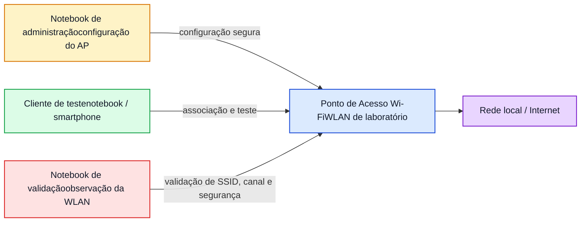

# Lab WiFi 3 - Hardening e Configuração Segura de uma WLAN

**Disciplina:** ENE0025 - Protocolos de Transporte e Roteamento  
**Curso:** Engenharia de Redes de Comunicação  
**Professor responsável:** Prof. Dr. Laerte Peotta de Melo  
**Ambiente:** Laboratório presencial com notebook Linux, AP de laboratório e cliente de teste  
**Tema:** Endurecimento de segurança e boas práticas de configuração de redes Wi-Fi

---

## Objetivo

Aplicar medidas de **hardening** em uma WLAN de laboratório, comparando uma configuração básica com uma configuração mais segura, com foco em:

- escolha do padrão de segurança;
- definição de SSID e credenciais;
- desativação de recursos inseguros;
- redução de superfície de exposição;
- validação prática da configuração final;
- análise técnica das decisões adotadas.

---

## Introdução 

O processo de proteção de uma rede Wi-Fi não depende de um único mecanismo, mas de um conjunto de decisões de configuração que afetam a confidencialidade, a integridade, a disponibilidade e a controlabilidade do acesso sem fio. Em uma WLAN, a superfície de exposição é ampliada pelo próprio meio físico de transmissão, já que o sinal se propaga pelo ambiente e pode ser captado além dos limites estritos do espaço organizacional. Por essa razão, a configuração segura de uma rede sem fio deve ser tratada como atividade essencial de administração e não como ajuste opcional.

Entre os principais elementos de proteção de uma WLAN estão o **mecanismo de autenticação**, o **protocolo de criptografia**, a **gestão de credenciais**, a **segmentação lógica da rede**, a **administração segura do ponto de acesso** e a **desativação de funcionalidades desnecessárias ou arriscadas**. Em contextos modernos, a adoção de **WPA2-AES** ou, preferencialmente, **WPA3**, representa uma prática recomendada, enquanto mecanismos legados e funcionalidades como **WEP**, **TKIP** e **WPS** devem ser evitados ou removidos quando presentes.

Do ponto de vista operacional, o hardening de uma WLAN também inclui decisões aparentemente simples, mas tecnicamente relevantes: nomeação adequada de SSID, uso de senhas robustas, atualização de firmware, troca de credenciais administrativas padrão, seleção criteriosa de canais e observação da potência e cobertura do sinal. Tais medidas reduzem fragilidades comuns, dificultam abuso de configuração e ajudam a organizar a rede de forma mais previsível e auditável.


Neste laboratório, o estudante atuará sobre uma WLAN de teste previamente disponibilizada pela disciplina, aplicando um conjunto de boas práticas de segurança. O foco não é explorar vulnerabilidades, mas sim **entender como configurar uma WLAN de forma mais segura**, justificando tecnicamente cada decisão adotada.

---

## Situação-problema

Uma rede Wi-Fi de laboratório foi instalada com configuração funcional, porém sem preocupação suficiente com segurança. A coordenação do ambiente solicita que a equipe técnica endureça essa WLAN antes de liberá-la para uso didático recorrente.

A equipe deve responder a perguntas como:

- o padrão de segurança configurado é adequado?
- há funções que devem ser desabilitadas?
- a senha escolhida é forte o suficiente?
- o ponto de acesso mantém credenciais administrativas seguras?
- a rede está identificada de forma apropriada?
- a WLAN final atende boas práticas mínimas de segurança?

---

## Competências desenvolvidas

- Compreender o conceito de hardening aplicado a redes Wi-Fi.
- Comparar mecanismos de proteção em WLANs.
- Identificar configurações inseguras em pontos de acesso.
- Aplicar boas práticas de configuração em ambiente controlado.
- Validar tecnicamente uma WLAN segura.

---

## Requisitos

- Notebook com Linux, Windows ou outro sistema autorizado para administração do AP.
- Ponto de acesso de laboratório previamente disponibilizado.
- Cliente de teste autorizado.
- Credenciais de administração do AP fornecidas pelo professor.
- Ferramentas úteis:
  - navegador web;
  - `nmcli`;
  - `iw`;
  - `airodump-ng` ou ferramenta equivalente de observação;
  - Wireshark, opcionalmente;
  - aplicativo de administração do fabricante, se adotado no laboratório.

> Este laboratório deve ocorrer apenas em ambiente autorizado pela disciplina.

---

## Topologia lógica



---

## Conceitos essenciais

| Conceito | Descrição |
|---|---|
| **Hardening** | Conjunto de medidas para reduzir riscos e tornar a WLAN mais segura e controlada. |
| **SSID** | Nome lógico da rede Wi-Fi. |
| **WPA2-AES** | Mecanismo amplamente aceito para proteção de WLANs; ainda muito usado. |
| **WPA3** | Evolução do modelo de segurança Wi-Fi, com melhorias de proteção e robustez. |
| **WEP** | Mecanismo legado e inseguro, não recomendado. |
| **TKIP** | Tecnologia legada associada a cenários antigos; deve ser evitada. |
| **WPS** | Recurso de emparelhamento simplificado que frequentemente amplia risco e deve ser desabilitado. |
| **Credencial administrativa** | Usuário e senha de administração do AP; não devem permanecer nos valores padrão. |
| **Segmentação** | Separação lógica de redes, como rede interna, visitantes e administração. |

---

## Critérios de segurança a considerar

A WLAN segura deve considerar, sempre que o equipamento permitir:

- uso de WPA2-AES ou WPA3;
- desativação de WPS;
- troca da senha administrativa padrão do AP;
- definição de senha forte para a rede;
- SSID coerente e identificável;
- revisão de canal e banda;
- atualização de firmware, quando disponível;
- separação entre rede principal e rede de convidados, quando aplicável.

---

## Etapa 1 - Levantamento da configuração atual

Antes de alterar qualquer parâmetro, registrar o estado inicial do AP.

Itens a coletar:

- SSID atual;
- tipo de segurança;
- senha da WLAN, se conhecida;
- credencial administrativa padrão ou atual;
- estado do WPS;
- canal e banda;
- versão de firmware;
- rede de convidados habilitada ou não.

### Tabela inicial

| Item | Configuração atual | Observação |
| --- | --- | --- |
| SSID |     |     |
| Segurança |     |     |
| Criptografia |     |     |
| WPS |     |     |
| Canal |     |     |
| Banda |     |     |
| Firmware |     |     |
| Usuário admin |     |     |
| Senha admin alterada? |     |     |
| Rede de convidados |     |     |

---

## Etapa 2 - Acesso ao painel administrativo do AP

Acessar o equipamento via navegador ou ferramenta apropriada.

Exemplos comuns de descoberta de gateway no cliente:

```bash
ip route
```

ou

```bash
nmcli dev show | grep GATEWAY
```

Identificar o endereço IP de administração e autenticar-se com as credenciais fornecidas pelo professor.

### Objetivo

Entrar no painel administrativo e localizar os menus de:

- Wi-Fi/WLAN;
- segurança;
- administração;
- atualização de firmware;
- serviços adicionais.

---

## Etapa 3 - Revisão do SSID

Avaliar se o SSID atual:

- expõe informação desnecessária;
- identifica inadequadamente o ambiente;
- usa nomes genéricos inseguros;
- está coerente com o propósito da rede.

Definir um SSID mais adequado, por exemplo:

- `LAB-WIFI-SEG`
- `ENGREDES-LAB`
- `LAB-ALUNOS`

### Observação

Ocultar SSID não deve ser tratado como principal mecanismo de segurança. A medida pode alterar comportamento operacional, mas não substitui autenticação e criptografia adequadas.

---

## Etapa 4 - Configuração do mecanismo de segurança

No AP, localizar a configuração de segurança da WLAN.

### Ajustes recomendados

- Preferir **WPA3**, quando suportado por AP e clientes do laboratório.
- Na indisponibilidade de WPA3, utilizar **WPA2-Personal com AES/CCMP**.
- Evitar:
  - WEP;
  - WPA legado;
  - TKIP, quando houver opção mais segura.

### Registro

| Opção | Antes | Depois |
| --- | --- | --- |
| Modo de segurança |     |     |
| Algoritmo de criptografia |     |     |

---

## Etapa 5 - Definição de senha forte

Configurar uma senha robusta para a WLAN.

### Requisitos sugeridos

- tamanho adequado;
- combinação de letras maiúsculas e minúsculas;
- números;
- caracteres especiais, quando compatíveis;
- ausência de palavras triviais, nomes do laboratório ou sequências previsíveis.

> Não registrar a senha real no relatório final público. Registrar apenas o padrão adotado, por exemplo: “senha com 16 caracteres, alfanumérica e com símbolo”.

---

## Etapa 6 - Desativação do WPS

Localizar o recurso **WPS** e verificar se está habilitado.

### Ação recomendada

Desabilitar o WPS.

### Justificativa

O objetivo é reduzir exposição desnecessária e evitar o uso de mecanismo simplificado de emparelhamento.

---

## Etapa 7 - Troca da credencial administrativa do AP

Localizar o menu de administração do equipamento.

Verificar se o ponto de acesso ainda utiliza:

- usuário padrão;
- senha padrão;
- senha fraca de administração.

### Ação recomendada

Alterar a credencial administrativa para uma combinação forte e não trivial.

### Registro

| Item | Antes | Depois |
| --- | --- | --- |
| Usuário administrativo |     |     |
| Senha administrativa alterada? |     |     |

> Não registrar a senha real no relatório entregue. Informar apenas que a senha foi trocada e segue política forte.

---

## Etapa 8 - Verificação de firmware

Localizar a versão atual do firmware.

Verificar no próprio painel, quando possível:

- versão instalada;
- data da versão;
- existência de atualização recomendada.

### Resultado esperado

O aluno deve registrar se:

- o firmware está atualizado;
- há recomendação de atualização;
- o equipamento do laboratório permite ou não atualização naquele momento.

---

## Etapa 9 - Escolha de canal e banda

Observar o ambiente Wi-Fi com ferramenta apropriada.

Exemplos:

```bash
nmcli dev wifi list
```

ou

```bash
sudo airodump-ng wlan0mon
```

### Objetivo

Identificar:

- canais mais congestionados;
- canal configurado atualmente;
- possibilidade de ajustar a WLAN para canal mais apropriado.

### Registro

| Item | Valor observado |
| --- | --- |
| Canal anterior |     |
| Canal adotado |     |
| Banda utilizada |     |
| Justificativa técnica |     |

---

## Etapa 10 - Rede de convidados e segmentação

Se o AP permitir, avaliar:

- existência de rede de convidados;
- separação entre clientes;
- isolamento entre rede principal e visitantes;
- acesso à rede interna.

### Ação

Registrar se:

- a rede de convidados foi habilitada;
- o isolamento foi configurado;
- a funcionalidade não está disponível no equipamento do laboratório.

---

## Etapa 11 - Aplicação e teste da nova configuração

Salvar as alterações no AP e reconectar o cliente de teste.

No cliente Linux, por exemplo:

```bash
nmcli dev wifi list
```

Conectar-se à nova WLAN:

```bash
nmcli dev wifi connect "LAB-WIFI-SEG" password "SENHA_FORNECIDA"
```

> Substitua apenas em ambiente autorizado.

### Validar

- a WLAN aparece corretamente;
- o cliente conecta com sucesso;
- a segurança anunciada está correta;
- o acesso básico está funcional;
- o WPS foi realmente desabilitado, quando aplicável.

---

## Etapa 12 - Validação observacional

Usar ferramenta de observação para conferir se o AP está anunciando corretamente a nova configuração.

Exemplo:

```bash
sudo airodump-ng wlan0mon
```

### Itens a validar

- SSID correto;
- canal correto;
- segurança coerente com o configurado;
- comportamento esperado após as mudanças.

---

## Checklist de hardening

Marque os itens concluídos.

| Medida | Status | Observação |
| --- | --- | --- |
| SSID revisado |     |     |
| WPA2-AES ou WPA3 configurado |     |     |
| WEP/TKIP evitados |     |     |
| Senha forte da WLAN definida |     |     |
| WPS desabilitado |     |     |
| Senha administrativa alterada |     |     |
| Firmware verificado |     |     |
| Canal revisado |     |     |
| Segmentação/rede convidados analisada |     |     |
| Cliente testado com sucesso |     |     |

---

## Comparação: configuração insegura x configuração segura

| Item | Configuração fraca | Configuração recomendada |
| --- | --- | --- |
| Segurança | WEP / WPA legado | WPA2-AES ou WPA3 |
| Credencial admin | padrão ou fraca | alterada e forte |
| WPS | habilitado | desabilitado |
| Senha Wi-Fi | curta ou previsível | forte e não trivial |
| SSID | inadequado ou confuso | coerente com a finalidade |
| Firmware | desatualizado ou não verificado | verificado / atualizado quando possível |

---

## Questões para análise

1. O que significa hardening em uma WLAN?
2. Por que WEP não deve ser utilizado?
3. Em quais condições WPA3 é preferível ao WPA2?
4. Qual o risco de manter credenciais administrativas padrão no AP?
5. Por que WPS deve ser desabilitado?
6. Uma senha forte, sozinha, resolve toda a segurança da WLAN? Explique.
7. Qual a importância da verificação de firmware?
8. Por que revisar canal e banda também faz parte da administração segura?
9. Ocultar o SSID substitui criptografia forte? Justifique.
10. Qual foi a principal melhoria de segurança aplicada neste laboratório?

---

## Boas práticas observadas no laboratório

- alterar primeiro a senha administrativa do AP;
- preferir WPA3 ou WPA2-AES;
- registrar a configuração antes e depois;
- validar tecnicamente a WLAN após cada mudança crítica;
- evitar exposição de credenciais reais nos relatórios.

---

## Critérios de avaliação

| Critério | Pontos |
| --- | --- |
| Levantamento correto da configuração inicial | 1,5 |
| Ajuste adequado do mecanismo de segurança | 2,0 |
| Política correta de senha e administração | 2,0 |
| Desativação de recursos inseguros | 1,5 |
| Validação técnica da WLAN após hardening | 1,5 |
| Qualidade da análise comparativa e respostas | 1,5 |

**Total: 10,0**

---

## Entregáveis

Cada aluno ou dupla deve entregar:

- tabela da configuração inicial;
- checklist de hardening preenchido;
- tabela comparativa antes/depois;
- evidências da configuração final;
- respostas das questões analíticas;
- conclusão curta com justificativa técnica das medidas adotadas.

---

## Modelo de conclusão esperada

Ao final do laboratório, o estudante deve ser capaz de concluir algo como:

> A WLAN do laboratório foi fortalecido por meio da adoção de mecanismo de segurança adequado, troca de credenciais frágeis, desativação de recursos inseguros e revisão de parâmetros operacionais. A atividade mostrou que a segurança Wi-Fi depende de múltiplas decisões coordenadas e que a configuração segura do AP é parte essencial da administração de redes sem fio.

---

