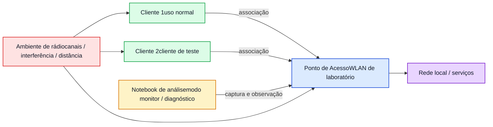

# Lab WiFi 4 - Troubleshooting e Análise de Segurança Wi-Fi

**Disciplina:** ENE0025 - Protocolos de Transporte e Roteamento  
**Curso:** Engenharia de Redes de Comunicação  
**Professor responsável:** Prof. Dr. Laerte Peotta de Melo  
**Ambiente:** Laboratório presencial com notebook Linux, AP de laboratório e cliente(s) de teste  
**Tema:** Diagnóstico operacional, análise de evidências e identificação de problemas em WLANs

---

## Objetivo

Diagnosticar problemas comuns em redes Wi-Fi de laboratório por meio de observação técnica, coleta de evidências e interpretação de sintomas, com foco em:

- intensidade e qualidade de sinal;
- canal e sobreposição;
- falhas de associação e autenticação;
- desconexões e instabilidade;
- identificação de quadros de gerenciamento relevantes;
- distinção entre comportamento normal e indício de problema de segurança.

---

## Introdução teórica

A operação de uma WLAN depende de fatores que vão além da simples presença de um ponto de acesso e de uma senha correta. Em ambientes reais, o desempenho e a estabilidade de redes Wi-Fi são influenciados por variáveis de rádio, interferência, competição pelo meio, posicionamento físico, mobilidade dos clientes, configuração do AP e mecanismos de segurança. Por essa razão, o processo de troubleshooting em redes sem fio exige uma abordagem orientada por evidências, capaz de correlacionar sintomas observados pelos usuários com elementos concretos de operação do protocolo IEEE 802.11.

Do ponto de vista técnico, falhas em WLANs podem surgir em diferentes camadas de observação. Há problemas relacionados ao **meio físico e radiofrequência**, como sinal fraco, ruído, atenuação e uso inadequado de canais. Há problemas relacionados ao **acesso à rede**, como autenticação malsucedida, associação incompleta, incompatibilidade entre cliente e AP, ou falhas provocadas por parâmetros de segurança inadequados. Há ainda questões associadas ao **comportamento do tráfego de gerenciamento**, incluindo excesso de reassociações, desautenticações, perda de conectividade intermitente e situações que podem indicar erro operacional, sobrecarga do ambiente ou mesmo atividade anômala.

Em contextos de segurança, o troubleshooting também se aproxima da análise defensiva. Isso ocorre porque sintomas como desconexões frequentes, SSIDs muito semelhantes, troca inesperada de BSSID, excesso de quadros deauth/disassoc ou variações abruptas de comportamento podem representar tanto problemas de configuração quanto indícios de eventos suspeitos. Assim, o profissional de redes precisa ser capaz de observar o ambiente, levantar hipóteses, validar evidências e propor ações corretivas coerentes.

Neste laboratório, o foco será a análise de cenários controlados de falha e instabilidade em uma WLAN autorizada da disciplina. O estudante deverá observar o comportamento da rede, registrar evidências e produzir um diagnóstico técnico fundamentado, sem realizar ações ofensivas e sem interferir em redes externas ao ambiente de laboratório.

---

## Situação-problema

Usuários de uma WLAN de laboratório relatam problemas como:

- dificuldade para conectar;
- lentidão excessiva;
- quedas frequentes de conexão;
- oscilação de sinal;
- autenticação aparentemente correta, mas sem estabilidade;
- comportamento estranho em certos momentos do experimento.

A equipe técnica precisa descobrir a causa provável e indicar medidas corretivas. Para isso, será necessário observar a rede, coletar dados e interpretar o comportamento do ambiente sem fio.

---

## Competências desenvolvidas

- Identificar sintomas comuns de falha em WLANs.
- Correlacionar sinal, canal, autenticação e estabilidade.
- Observar quadros de gerenciamento relevantes para troubleshooting.
- Diferenciar falha operacional de possível comportamento anômalo.
- Produzir diagnóstico técnico com base em evidências.

---

## Requisitos

- Notebook com Linux (Kali, Parrot, Ubuntu ou Debian).
- Adaptador Wi-Fi com suporte a modo monitor, quando disponível.
- Ponto de acesso de laboratório já configurado.
- Cliente de teste autorizado.
- Ferramentas úteis:
  - `ip`
  - `iw`
  - `iwconfig`
  - `nmcli`
  - `airmon-ng`
  - `airodump-ng`
  - `wavemon` ou equivalente
  - Wireshark
  - `journalctl`
  - `ping`

> Todas as atividades devem ocorrer apenas em infraestrutura autorizada da disciplina.

---

## Topologia lógica



---

## Conceitos essenciais

| Conceito | Descrição |
|---|---|
| **RSSI / intensidade de sinal** | Indicador aproximado da potência do sinal recebido no ponto de observação. |
| **Canal** | Faixa operacional usada pelo AP; excesso de redes no mesmo canal pode degradar a operação. |
| **Sobreposição de canais** | Condição em que redes próximas competem parcialmente pelo mesmo espectro, aumentando interferência. |
| **Associação** | Entrada lógica do cliente na WLAN. |
| **Autenticação** | Etapa de validação necessária para acesso à rede. |
| **Beacon** | Quadro periódico do AP, importante para descoberta da rede e análise operacional. |
| **Deauthentication** | Quadro de gerenciamento relacionado à remoção ou quebra de vínculo do cliente com a rede. |
| **Disassociation** | Quadro que indica término ou quebra da associação entre cliente e AP. |
| **Instabilidade** | Comportamento caracterizado por reconexões frequentes, latência variável ou perda intermitente de conectividade. |


---

## Cenários sugeridos de troubleshooting

O professor pode escolher um ou mais dos cenários abaixo:

| Cenário | Descrição |
|---|---|
| **Sinal fraco** | Cliente afastado do AP ou com obstáculo significativo. |
| **Canal congestionado** | Várias redes observadas no mesmo canal ou em canais próximos. |
| **Falha de credencial / autenticação** | Cliente com senha incorreta ou configuração incompatível. |
| **Desconexão intermitente** | Cliente conecta e cai repetidamente. |
| **Quadros de deauth/disassoc em excesso** | Situação controlada para análise de sintomas no Wireshark. |
| **Roaming ou mudança de ponto de observação** | Variação do sinal ao deslocar o cliente no ambiente. |
  

---

## Etapa 1 - Levantamento inicial do ambiente

No cliente de análise, identificar a interface Wi-Fi:

```bash
ip link show
```

ou

```bash
iw dev
```

Listar redes disponíveis:

```bash
nmcli dev wifi list
```

Registrar:

- SSID do laboratório;
- BSSID;
- canal;
- frequência;
- intensidade do sinal;
- segurança anunciada.

### Tabela inicial

| Item | Valor observado |
| --- | --- |
| SSID |     |
| BSSID |     |
| Canal |     |
| Frequência |     |
| Sinal |     |
| Segurança |     |

---

## Etapa 2 - Verificação de conectividade básica do cliente

No cliente de teste, verificar:

```bash
nmcli connection show --active
```

Identificar endereço IP:

```bash
ip addr show
```

Testar conectividade local e externa, quando aplicável:

```bash
ping -c 4 192.168.10.1
```

ou

```bash
ping -c 4 8.8.8.8
```

### Objetivo

Determinar se o problema é:

- apenas de associação;
- apenas de autenticação;
- de conectividade IP;
- de instabilidade intermitente.

---

## Etapa 3 - Medição do sinal

No cliente ou no monitor:

```bash
iw dev wlan0 link
```

ou, quando não associado:

```bash
nmcli dev wifi list
```

ou ainda:

```bash
wavemon
```

### O que observar

- intensidade do sinal;
- variação do sinal por posição;
- diferenças entre pontos do ambiente;
- relação entre sinal fraco e sintomas percebidos.

### Registro

| Ponto de medição | Sinal observado | Sintoma percebido |
| --- | --- | --- |
| Próximo ao AP |     |     |
| Distância média |     |     |
| Distante / com obstáculo |     |     |

---

## Etapa 4 - Ativação do modo monitor

No notebook de análise:

```bash
sudo airmon-ng
```

Ativar modo monitor:

```bash
sudo airmon-ng start wlan0
```

Verificar o nome da interface:

```bash
iw dev
```

Normalmente algo como:

- `wlan0mon`

---

## Etapa 5 - Observação do ambiente com `airodump-ng`

Executar:

```bash
sudo airodump-ng wlan0mon
```

### O que observar

- quantidade de redes no mesmo canal;
- potência do AP do laboratório;
- clientes associados;
- variação de presença do cliente de teste;
- possíveis quadros ou comportamentos que indiquem instabilidade.

---

## Etapa 6 - Foco em canal e BSSID específicos

Concentrar a análise no AP do laboratório:

```bash
sudo airodump-ng --bssid AA:BB:CC:DD:EE:FF --channel 6 wlan0mon
```

> Substitua pelo BSSID e canal reais.

### Objetivo

Observar:

- clientes associados ao AP;
- estabilidade da associação;
- desaparecimento e reaparecimento do cliente;
- intensidade do sinal no contexto daquele AP.

---

## Etapa 7 - Captura para análise posterior

Salvar captura:

```bash
sudo airodump-ng --bssid AA:BB:CC:DD:EE:FF --channel 6 --write captura_labwifi4 wlan0mon
```

### Resultado esperado

Geração de arquivo `.cap` para análise no Wireshark.

---

## Etapa 8 - Inspeção no Wireshark

Abrir o arquivo `.cap` no Wireshark.

### Filtros úteis

#### Beacon

```text
wlan.fc.type_subtype == 8
```

#### Authentication / Association

```text
wlan.fc.type_subtype == 11 || wlan.fc.type_subtype == 0 || wlan.fc.type_subtype == 1
```

#### Deauthentication

```text
wlan.fc.type_subtype == 12
```

#### Disassociation

```text
wlan.fc.type_subtype == 10
```

#### EAPOL

```text
eapol
```

### O que observar

- se o cliente autentica e associa corretamente;
- se há repetição excessiva de autenticação;
- se aparecem quadros de deauth/disassoc;
- se o comportamento é consistente com queda de conexão;
- se há evidências que expliquem a experiência do usuário.

---

## Etapa 9 - Logs do sistema operacional

No cliente Linux, acompanhar logs:

```bash
journalctl -fu NetworkManager
```

ou

```bash
sudo dmesg -w
```

### Objetivo

Comparar:

- mensagens do sistema;
- momento da queda;
- tentativa de reconexão;
- erro de senha;
- perda de associação;
- alteração de potência ou interface.

---

## Etapa 10 - Diagnóstico por cenário

### Cenário A - Sinal fraco

Indicadores comuns:

- RSSI baixo;
- melhora perceptível ao aproximar do AP;
- instabilidade maior em posição mais distante;
- perda de desempenho associada ao deslocamento.

### Cenário B - Canal congestionado

Indicadores comuns:

- muitas redes no mesmo canal;
- redução de estabilidade em horários ou momentos específicos;
- competição elevada no espectro.

### Cenário C - Erro de autenticação

Indicadores comuns:

- cliente enxerga a rede, mas não entra;
- repetição de tentativas;
- falhas associadas à senha ou política de segurança.

### Cenário D - Desconexões intermitentes

Indicadores comuns:

- associação seguida de queda;
- repetição de autenticação/associação;
- quadros de deauth/disassoc;
- logs repetitivos no sistema.

---

## Tabela de diagnóstico

| Sintoma | Evidência coletada | Causa provável | Ação corretiva sugerida |
| --- | --- | --- | --- |
|     |     |     |     |
|     |     |     |     |
|     |     |     |     |

---

## Comparação: problema operacional x indício de evento suspeito

| Situação observada | Pode ser problema operacional? | Pode ser indício de evento suspeito? | Comentário |
| --- | --- | --- | --- |
| Sinal fraco | Sim | Não necessariamente |     |
| Muitos APs no mesmo canal | Sim | Não necessariamente |     |
| Senha incorreta | Sim | Não necessariamente |     |
| Muitos deauth/disassoc | Sim | Sim | Exige análise cuidadosa |
| SSID muito parecido com outro | Às vezes | Sim | Pode exigir validação do BSSID |
| Cliente cai e reassocia repetidamente | Sim | Sim | Correlacionar com logs e captura |

---

## Questões para análise

1. Qual a diferença entre sinal fraco e erro de autenticação?
2. Como o canal influencia o desempenho de uma WLAN?
3. O que os quadros beacon ajudam a identificar?
4. O que um excesso de deauthentication pode indicar?
5. Qual a diferença entre desconexão por problema físico e por problema de segurança?
6. Por que o troubleshooting em Wi-Fi depende de evidências e não apenas de sintomas relatados?
7. Um cliente pode “ver” a rede e ainda assim não conseguir usá-la? Explique.
8. Por que logs do sistema e captura 802.11 devem ser correlacionados?
9. Em qual cenário o problema pareceu mais relacionado à configuração?
10. Qual foi a principal hipótese diagnóstica construída a partir das evidências?

---

## Boas práticas observadas no laboratório

- começar pela observação básica antes da captura detalhada;
- registrar horário, canal e BSSID da análise;
- correlacionar o relato do usuário com evidência objetiva;
- evitar conclusões precipitadas sem validar sinais e quadros;
- diferenciar claramente hipótese, evidência e conclusão.

---

## Critérios de avaliação

| Critério | Pontos |
| --- | --- |
| Levantamento inicial correto do ambiente | 1,5 |
| Coleta de evidências técnicas | 2,0 |
| Uso adequado das ferramentas de diagnóstico | 2,0 |
| Interpretação correta do cenário observado | 2,0 |
| Tabela de diagnóstico preenchida com consistência | 1,5 |
| Respostas analíticas e conclusão final | 1,0 |

**Total: 10,0**

---

## Entregáveis

Cada aluno ou dupla deve entregar:

- tabela inicial do ambiente;
- prints ou evidências de sinal e canal;
- evidência da captura ou filtros no Wireshark;
- tabela de diagnóstico preenchida;
- respostas das questões propostas;
- conclusão curta com causa provável e ação corretiva recomendada.

---

## Modelo de conclusão esperada

Ao final do laboratório, o estudante deve ser capaz de concluir algo como:

> A análise da WLAN permitiu correlacionar sintomas percebidos com evidências técnicas observadas em sinal, canal, eventos de associação e quadros de gerenciamento. O experimento mostrou que o troubleshooting em redes Wi-Fi exige abordagem sistemática, combinando observação do ambiente, captura 802.11, logs do sistema e interpretação cuidadosa para distinguir falha operacional de comportamento potencialmente anômalo.

---

## Encerramento do modo monitor

Ao final da atividade:

```bash
sudo airmon-ng stop wlan0mon
sudo systemctl restart NetworkManager
```

> Ajuste o nome da interface, se necessário.

---

## Fechamento da sequência

Com este laboratório, a sequência de Wi-Fi cobre:

- **Lab WiFi 1:** reconhecimento do ambiente sem fio;
- **Lab WiFi 2:** associação, autenticação e handshake;
- **Lab WiFi 3:** hardening e configuração segura;
- **Lab WiFi 4:** troubleshooting e análise de segurança.

Essa progressão permite que o estudante observe, compreenda, proteja e diagnostique redes WLAN em ambiente autorizado de laboratório.
