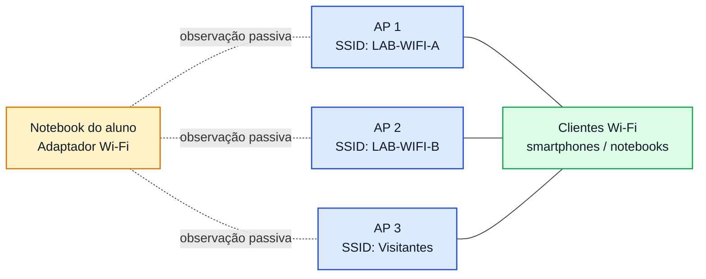

# Lab WiFi 1 - Reconhecimento do Ambiente Sem Fio

**Disciplina:** ENE0025 - Protocolos de Transporte e Roteamento  
**Curso:** Engenharia de Redes de Comunicação  
**Professor responsável:** Prof. Dr. Laerte Peotta de Melo  
**Ambiente:** Laboratório presencial com notebook Linux e adaptador Wi-Fi compatível  
**Tema:** Descoberta passiva e análise inicial de redes IEEE 802.11

---

## Objetivo

Realizar o reconhecimento **passivo** de um ambiente Wi-Fi para identificar parâmetros básicos de operação das redes sem fio próximas, compreendendo como observar:

- SSID e BSSID;
- canal e banda utilizada;
- intensidade de sinal;
- tipo de segurança anunciado;
- presença de quadros de gerenciamento;
- diferenças entre rede visível, cliente associado e ponto de acesso.

Este laboratório tem foco em **observação e análise**, sem associação indevida, sem interferência e sem geração de tráfego ofensivo.

---

## Introdução

Redes Wi-Fi fazem parte do cotidiano de usuários, empresas, universidades e ambientes domésticos. Antes de configurar, proteger ou diagnosticar uma WLAN, é necessário saber **enxergar o ambiente sem fio**.

Na prática, isso significa entender como um adaptador Wi-Fi pode detectar redes próximas, observar parâmetros transmitidos pelos pontos de acesso e identificar sinais importantes do funcionamento do protocolo IEEE 802.11.

Neste primeiro laboratório, o estudante aprenderá a:

- identificar redes anunciadas;
- diferenciar nome da rede e endereço físico do AP;
- verificar canal e frequência;
- analisar a potência do sinal;
- reconhecer o papel dos **quadros beacon** no anúncio da rede.

Este laboratório é a base para os próximos experimentos sobre associação, segurança, hardening e troubleshooting em WLANs.


---

## Situação-problema

Uma equipe de redes precisa levantar as características do ambiente Wi-Fi de um laboratório antes de propor melhorias de cobertura, segurança e desempenho.

Antes de qualquer mudança, é necessário responder perguntas como:

- quais SSIDs estão presentes no ambiente?
- quantos APs existem?
- quais canais estão mais ocupados?
- há redes em 2,4 GHz, 5 GHz ou ambas?
- quais redes usam proteção aberta ou protegida?
- qual AP apresenta melhor sinal no ponto de medição?

O objetivo do laboratório é construir esse primeiro diagnóstico de forma **passiva e controlada**.

---

## Competências desenvolvidas

- Compreender o papel do reconhecimento passivo em redes Wi-Fi.
- Identificar elementos básicos da arquitetura IEEE 802.11.
- Diferenciar SSID, BSSID, canal, frequência e banda.
- Ler informações operacionais de um ambiente sem fio.
- Coletar evidências técnicas para análise de cobertura e segurança.

---

## Requisitos

- Notebook com Linux (Kali, Parrot, Ubuntu ou Debian).
- Adaptador Wi-Fi com suporte a modo monitor, quando disponível.
- Permissão para uso do ambiente de laboratório.
- Ferramentas instaladas:
  - `ip`
  - `iw`
  - `iwconfig`
  - `nmcli`
  - `airmon-ng`
  - `airodump-ng`
  - `tcpdump` ou Wireshark

> Este laboratório deve ser executado apenas em ambiente autorizado pela disciplina.

---

## Topologia lógica



---

## Conceitos essenciais

### SSID
Nome lógico da rede Wi-Fi exibido aos usuários.

### BSSID
Endereço MAC do ponto de acesso que anuncia a rede.

### Canal
Faixa operacional em que o AP transmite.

### Banda
Faixa de frequência usada pela rede, normalmente 2,4 GHz ou 5 GHz.

### Beacon
Quadro de gerenciamento transmitido periodicamente pelo AP para anunciar a existência da rede.

### Modo monitor
Modo em que a interface Wi-Fi observa quadros 802.11 sem necessariamente associar-se a uma rede.

---

## Etapa 1 - Identificação da interface sem fio

Listar interfaces de rede:

```bash
ip link show
```

ou

```bash
iw dev
```

Identificar o nome da interface Wi-Fi, por exemplo:

- `wlan0`
- `wlp2s0`

Verificar informações adicionais:

```bash
iwconfig
```

### Resultado esperado
O aluno deve identificar claramente qual interface pertence ao adaptador sem fio.

---

## Etapa 2 - Descoberta inicial de redes com o NetworkManager

Fazer uma varredura simples:

```bash
nmcli dev wifi list
```

ou

```bash
nmcli -f IN-USE,SSID,BSSID,CHAN,FREQ,RATE,SIGNAL,SECURITY dev wifi list
```

### O que observar
- nome da rede;
- endereço MAC do AP;
- canal;
- frequência;
- intensidade do sinal;
- segurança anunciada.

### Resultado esperado
Visualização inicial das redes disponíveis no ambiente.

---

## Etapa 3 - Leitura detalhada com `iw`

Executar:

```bash
sudo iw dev wlan0 scan | less
```

> Substitua `wlan0` pelo nome real da interface.

Buscar no resultado campos como:

- `SSID`
- `BSS`
- `freq`
- `signal`
- `RSN`
- `capability`

### O que o aluno deve aprender
O comando mostra informações mais detalhadas do que a listagem gráfica, permitindo entender melhor o anúncio da rede.

---

## Etapa 4 - Ativação de modo monitor

Verificar se o adaptador suporta modo monitor:

```bash
sudo airmon-ng
```

Ativar modo monitor:

```bash
sudo airmon-ng start wlan0
```

Depois, listar interfaces novamente:

```bash
iw dev
```

Normalmente surgirá algo como:

- `wlan0mon`

> Em alguns sistemas, o nome da interface em modo monitor pode variar.

### Resultado esperado
A interface de monitoramento deve aparecer ativa para observação passiva dos quadros 802.11.

---

## Etapa 5 - Observação passiva do ambiente com `airodump-ng`

Executar:

```bash
sudo airodump-ng wlan0mon
```

### O que observar
Na parte superior:
- BSSID
- PWR
- Beacons
- CH
- MB
- ENC
- CIPHER
- AUTH
- ESSID

Na parte inferior:
- estações clientes detectadas;
- AP ao qual podem estar associadas;
- sinais de mobilidade do ambiente.

### Interpretação rápida
- **PWR** indica potência relativa do sinal.
- **Beacons** mostra quantos anúncios foram observados.
- **CH** informa o canal.
- **ENC/CIPHER/AUTH** indicam o modelo de proteção anunciado.
- **ESSID** mostra o nome da rede.

---

## Etapa 6 - Foco em um canal específico

Escolher uma rede identificada no passo anterior e observar apenas o canal correspondente.

Exemplo:

```bash
sudo airodump-ng --channel 6 wlan0mon
```

### Objetivo
Reduzir o volume de informação e observar com mais clareza as redes presentes em um canal específico.

---

## Etapa 7 - Foco em um único BSSID

Escolher um AP específico e observar apenas esse ponto de acesso.

Exemplo:

```bash
sudo airodump-ng --bssid AA:BB:CC:DD:EE:FF --channel 6 wlan0mon
```

### Objetivo
Analisar um AP individualmente, identificando:
- intensidade de sinal;
- estabilidade do beacon;
- clientes observados;
- canal utilizado.

---

## Etapa 8 - Captura passiva para análise posterior

Salvar a captura em arquivo:

```bash
sudo airodump-ng --write captura_labwifi1 --output-format pcap wlan0mon
```

Arquivos esperados:
- `captura_labwifi1-01.cap`
- arquivos complementares de texto ou CSV, dependendo da ferramenta

### Objetivo
Permitir abertura posterior no Wireshark para análise dos quadros beacon e gerenciamento.

---

## Etapa 9 - Análise básica no Wireshark

Abrir o arquivo `.cap` no Wireshark e aplicar filtros simples, como:

```text
wlan.fc.type_subtype == 8
```

Esse filtro mostra **beacons**.

### O que observar
- SSID anunciado;
- BSSID;
- canal;
- parâmetros do beacon;
- intervalos de anúncio;
- capacidades anunciadas pelo AP.

> Nesta etapa, o foco é apenas identificar e interpretar os quadros, não aprofundar análise ofensiva.

---

## Tabela de coleta de resultados

Preencha a tabela abaixo com pelo menos 5 redes identificadas, quando disponíveis.

| # | SSID | BSSID | Canal | Banda | Sinal | Segurança | Observação |
|---|---|---|---|---|---|---|---|
| 1 |  |  |  |  |  |  |  |
| 2 |  |  |  |  |  |  |  |
| 3 |  |  |  |  |  |  |  |
| 4 |  |  |  |  |  |  |  |
| 5 |  |  |  |  |  |  |  |

---

## Questões para análise

1. Qual a diferença entre SSID e BSSID?
2. Por que dois APs podem anunciar o mesmo SSID e ter BSSIDs diferentes?
3. Qual a diferença prática entre banda de 2,4 GHz e 5 GHz?
4. O que significa o canal da rede Wi-Fi?
5. O que os quadros beacon fazem?
6. O que a intensidade do sinal indica?
7. Uma rede com SSID oculto deixa de existir no ambiente? Explique.
8. Por que o modo monitor é útil para diagnóstico de redes Wi-Fi?
9. O que pode indicar excesso de redes no mesmo canal?
10. Qual foi o AP com melhor sinal no seu ponto de medição e por quê?

---

## Boas práticas observadas no laboratório

- realizar apenas observação passiva;
- não desconectar clientes;
- não forçar reassociação;
- não modificar parâmetros do AP;
- registrar evidências antes de concluir;
- correlacionar canal, sinal e segurança para análise mais consistente.

---

## Critérios de avaliação

| Critério | Pontos |
|---|---:|
| Identificação correta da interface e ferramentas | 1,0 |
| Execução da varredura inicial e coleta básica | 1,5 |
| Ativação correta do modo monitor | 1,5 |
| Uso adequado do `airodump-ng` | 2,0 |
| Preenchimento da tabela de resultados | 1,5 |
| Evidências de captura e análise no Wireshark | 1,5 |
| Respostas às questões analíticas | 1,0 |

**Total: 10,0**

---

## Entregáveis

Cada aluno ou dupla deve entregar:

- print da interface Wi-Fi identificada;
- print da listagem inicial de redes;
- print do `airodump-ng` em execução;
- tabela preenchida com as redes observadas;
- evidência de ao menos um beacon no Wireshark;
- resposta das questões propostas;
- conclusão curta com diagnóstico do ambiente.

---

## Modelo de conclusão esperada

Ao final do laboratório, o estudante deve ser capaz de concluir algo como:

> O ambiente analisado possui múltiplos SSIDs, com distribuição em diferentes canais e níveis variados de sinal. Foi possível identificar BSSIDs distintos, tipos de segurança anunciados e presença de quadros beacon. A observação passiva permitiu compreender como o ambiente Wi-Fi é anunciado e como esses dados podem apoiar configuração, hardening e troubleshooting.

---

## Encerramento do modo monitor

Ao terminar a atividade:

```bash
sudo airmon-ng stop wlan0mon
sudo systemctl restart NetworkManager
```

> Ajuste o nome da interface se necessário.

---
